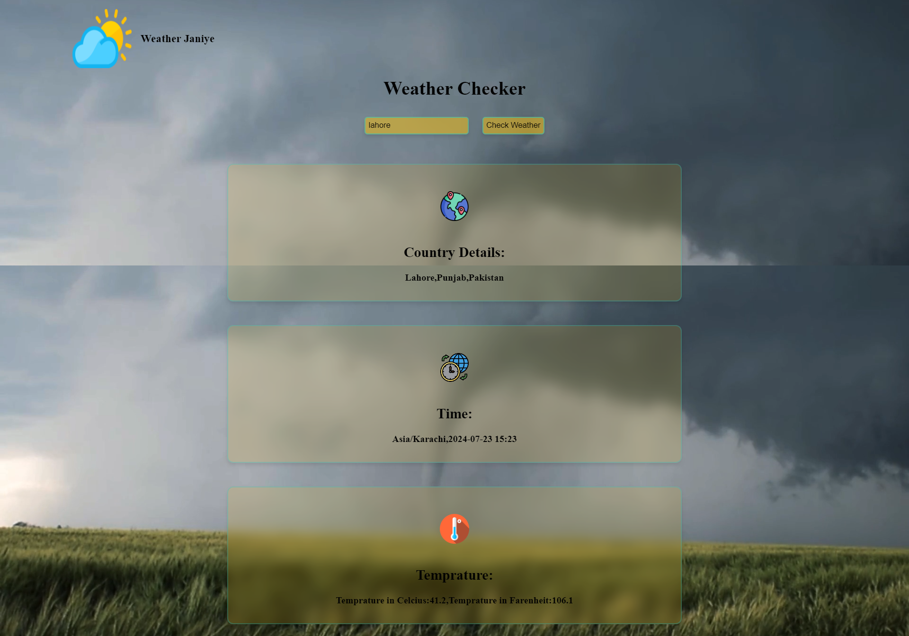

# Weather Janiye 🌤️

Welcome to **Weather Janiye** – a simple yet effective weather checker app. This project is built using HTML, CSS, and JavaScript to provide you with current weather information based on city input.

## Table of Contents

- [Features](#features)
- [Installation](#installation)
- [Usage](#usage)
- [Screenshots](#screenshots)
- [Technologies Used](#technologies-used)
- [Acknowledgements](#acknowledgements)


## Features ✨

- Real-time weather updates.
- Displays city, country, local time, and temperature.
- User-friendly interface with background video.

## Installation 🛠️

To run this project locally, follow these steps:

1. Clone the repository:
    ```sh
    git clone https://github.com/Ihtesham-Latif/weather-janiye.git
    ```

2. Navigate to the project directory:
    ```sh
    cd weather-janiye
    ```

3. Open `index.html` in your browser to view the app.

## Usage 🚀

1. Open the app.
2. Enter the name of the city in the input field.
3. Click on the "Check Weather" button.
4. View the weather details displayed on the screen.

## Screenshots 📸



## Technologies Used 🛠️

- HTML5
- CSS3
- JavaScript (ES6)
- Weather API from [WeatherAPI.com](https://www.weatherapi.com/)

## Acknowledgements 🙏

- [WeatherAPI.com](https://www.weatherapi.com/) for providing the weather data API.
- Icons made by [Freepik](https://www.flaticon.com/authors/freepik) from [Flaticon](https://www.flaticon.com/).


